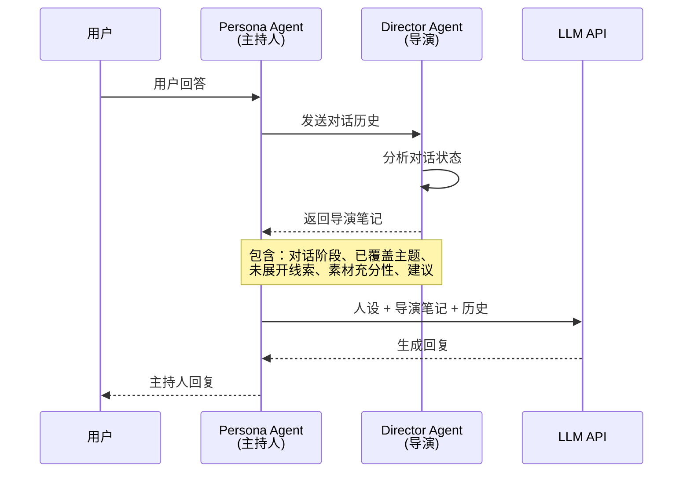

# WeTales

> AI 驱动的对话式采访系统，让每个人都能拥有杂志级的人物专访

## ✨ 项目亮点

- **双 Agent 架构**：Director Agent（导演）+ Persona Agent（主持人）协同工作
- **深度采访**：多轮对话，自动追问、深挖、换话题，像真人记者一样采访
- **杂志级输出**：自动生成排版精美的人物专访文章，支持双列排版和金句展示
- **语音输入**：支持 ASR 语音转文字，让对话更自然
- **多风格采访**：共鸣者（温和共情）和解构者（犀利直接）两种采访风格

---

## 🏗️ 系统架构

### 整体架构

```mermaid
graph TB
    subgraph "前端 (Next.js + React)"
        A[首页 - 选择采访者] --> B[采访页 - 对话界面]
        B --> C[杂志页 - 文章展示]
    end

    subgraph "后端 API Routes"
        D[/api/interview/start - 开场白]
        E[/api/interview/chat - 对话]
        F[/api/interview/generate-article - 生成文章]
        G[/api/asr - 语音识别]
    end

    subgraph "Agent 系统"
        H[Director Agent<br/>对话分析 · 策略建议]
        I[Persona Agent<br/>人格化采访 · 生成回复]
    end

    subgraph "外部服务"
        J[DeepSeek / OpenAI<br/>LLM API]
        K[硅基流动<br/>ASR API]
    end

    B --> D
    B --> E
    B --> F
    B --> G
    E --> H
    E --> I
    H --> J
    I --> J
    G --> K
```

### Agent 协作流程



### 核心组件说明

| 组件 | 职责 | 特点 |
|------|------|------|
| **Director Agent** | 后台观察者，分析对话进度 | Advisory, not directive（建议而非指挥）|
| **Persona Agent** | 采访主持人，与用户对话 | 人格化、有风格、有温度 |
| **Skill Loader** | 加载采访者人设定义 | 基于真实采访数据分析 |
| **Article Generator** | 从对话中提取素材生成文章 | 结构化提取 + 杂志风格输出 |

---

## 🚀 快速开始

### 环境要求

- Node.js 18+
- npm 或 yarn
- DeepSeek API Key（或其他 OpenAI 兼容 API）
- 硅基流动 API Key（用于语音识别，可选）

### 安装步骤

```bash
# 1. 克隆仓库
git clone https://github.com/Lucia-law/wetales.git
cd wetales

# 2. 安装依赖
npm install

# 3. 配置环境变量
cp .env.example .env.local
# 编辑 .env.local，填入你的 API Key

# 4. 启动开发服务器
npm run dev
```

### 环境变量配置

在项目根目录创建 `.env.local` 文件：

```env
# DeepSeek API（主持人 LLM）
OPENAI_API_KEY=sk-your-api-key-here
OPENAI_BASE_URL=https://api.deepseek.com
MODEL_NAME=deepseek-v4-pro

# 硅基流动 ASR（语音转文字，可选）
ASR_API_KEY=sk-your-asr-key-here
ASR_BASE_URL=https://api.siliconflow.cn/v1
ASR_MODEL=FunAudioLLM/SenseVoiceSmall
```

---

## 📁 项目结构

```
WeTales/
├── src/
│   ├── app/
│   │   ├── page.tsx                    # 首页 - 选择采访者
│   │   ├── layout.tsx                  # 全局布局
│   │   ├── globals.css                 # 全局样式
│   │   ├── interview/
│   │   │   └── page.tsx                # 采访页 - 对话界面
│   │   ├── magazine/
│   │   │   ├── page.tsx                # 杂志列表页
│   │   │   └── generate/
│   │   │       └── page.tsx            # 文章生成页
│   │   └── api/
│   │       ├── interview/
│   │       │   ├── start/route.ts      # 开场白 API
│   │       │   ├── chat/route.ts       # 对话 API
│   │       │   └── generate-article/   # 文章生成 API
│   │       └── asr/route.ts            # 语音识别 API
│   └── lib/
│       ├── director.ts                 # Director Agent 实现
│       ├── interview-utils.ts          # 采访工具函数
│       ├── llm.ts                      # LLM 调用封装
│       ├── skill-loader.ts             # 人设加载器
│       └── types.ts                    # TypeScript 类型定义
├── skills/
│   ├── resonator/
│   │   └── SKILL.md                    # 共鸣者人设定义
│   └── deconstructor/
│       └── SKILL.md                    # 解构者人设定义
├── public/
│   └── avatars/                        # 采访者头像
├── .env.example                        # 环境变量示例
├── .env.local                          # 环境变量（本地）
├── package.json
└── README.md
```

---

## 🎯 核心功能

### 1. 双 Agent 采访系统

**Persona Agent（主持人）**
- 基于真实采访数据构建的人格化采访者
- 两种风格：共鸣者（温和共情）和解构者（犀利直接）
- 自动追问、深挖细节、换话题、结束采访

**Director Agent（导演）**
- 后台观察对话，分析采访进度
- 判断素材充分性（不足/勉强/充分）
- 提供非指令性建议，尊重主持人自主权

### 2. 杂志级文章生成

- 从对话中提取结构化信息（人物、故事、场景、金句）
- 自动生成杂志风格的人物专访文章
- 支持双列排版、大字金句、首字下沉
- 响应式设计，适配移动端和桌面端

### 3. 语音输入

- 集成硅基流动 ASR API
- 支持实时语音转文字
- 录音结束后文字落入输入框，可编辑后发送

---

## 🛠️ 技术栈

| 类别 | 技术 | 说明 |
|------|------|------|
| **前端框架** | Next.js 16 | React 全栈框架 |
| **UI 库** | React 19 | 用户界面构建 |
| **样式** | Tailwind CSS 4 | 原子化 CSS 框架 |
| **语言** | TypeScript | 类型安全的 JavaScript |
| **AI 模型** | DeepSeek / OpenAI | LLM API |
| **语音识别** | 硅基流动 ASR | 语音转文字 |
| **部署** | Vercel | 云部署平台 |

---

## 📖 使用说明

### 开始采访

1. **访问首页**：选择采访者风格（共鸣者或解构者）
2. **填写信息**：输入昵称、选择话题方向、补充说明（可选）
3. **进入采访**：点击"Enter studio"开始采访

### 进行采访

- **文字输入**：在底部输入框输入文字
- **语音输入**：点击麦克风按钮录音，结束后自动转文字
- **发送消息**：点击发送按钮或按 Enter 键
- **结束采访**：点击红色结束按钮

### 查看文章

- 结束采访后自动跳转到文章生成页
- 系统自动提取素材并生成杂志风格的文章
- 如果信息量不足，可以选择"Resume Interview"继续采访

---

## 📝 Agent 设计理念

### Director Agent：Advisory, not directive

Director Agent 的核心原则是**建议而非指挥**：

- ✅ 提供对话阶段、主题覆盖、素材充分性等元信息
- ✅ 给出非指令性建议（"受访者两次提到父亲但未深入，采访者可酌情考虑"）
- ❌ 不写台词、不决定问什么问题
- ❌ 不强制采访者遵循建议

这种设计尊重了 Persona Agent 的自主权，让采访更自然、更有温度。

### Persona Agent：人格化采访

Persona Agent 基于真实采访数据构建，具有：

- **语言 DNA**：标志性用语、高频词、句式特征
- **人格特质**：OCEAN 大五人格评估
- **思维模式**：递进式提问、因果框架、具象-抽象双向思维
- **采访流程**：提问、倾听、安全空间、节奏控制、情感共鸣
- **核心原则**：不评判、主动倾听、安全空间

---

## 📄 License

MIT License

---

## 🙏 致谢

- [Next.js](https://nextjs.org/) - React 全栈框架
- [Tailwind CSS](https://tailwindcss.com/) - CSS 框架
- [DeepSeek](https://deepseek.com/) - AI 模型服务
- [硅基流动](https://siliconflow.cn/) - ASR 语音识别服务
