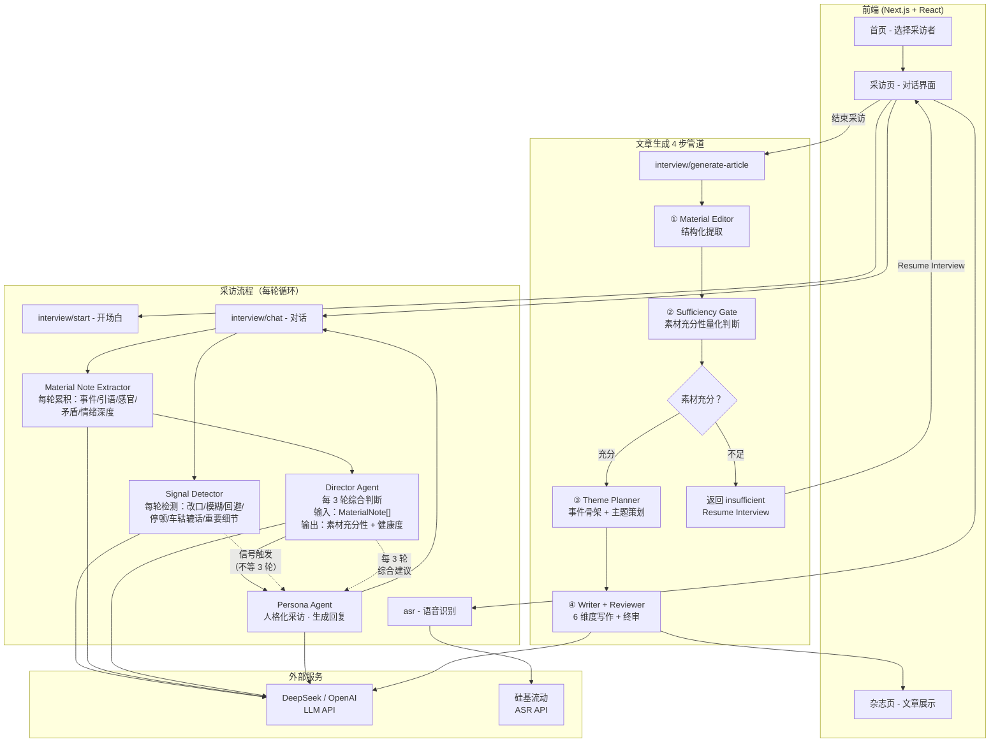
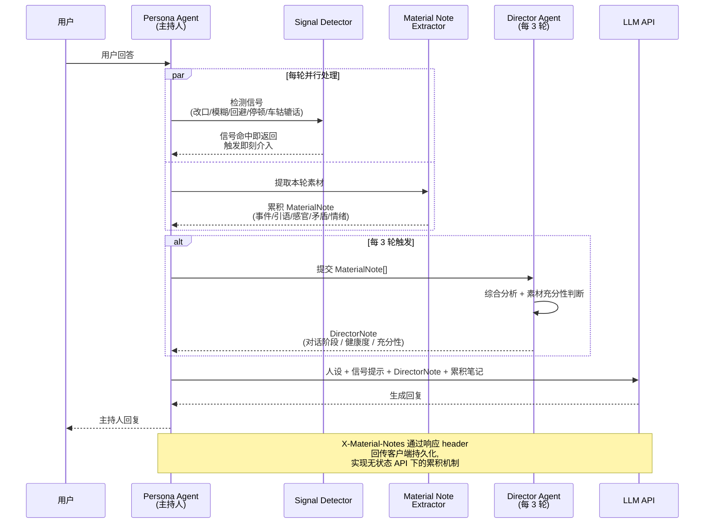

# WeTales

> AI 驱动的对话式采访系统，让每个人都能拥有杂志级的人物专访

## ✨ 项目亮点

- **三层 Agent 协同**：Persona Agent（主持人）+ Signal Detector（每轮信号检测）+ Director Agent（每 3 轮综合判断）
- **每轮素材累积**：MaterialNote 替代原始 history，无状态 API 下的"伪 session"机制
- **深度采访**：多轮对话、信号触发即刻介入、每 3 轮综合建议，模拟真人记者节奏
- **杂志级输出**：4 步文章生成管道（Material Editor → Sufficiency Gate → Theme Planner → Writer+Reviewer），6 维度方法论 + 事件骨架
- **语音输入**：支持 ASR 语音转文字，让对话更自然
- **多风格采访**：共鸣者（温和共情）和解构者（犀利直接）两种人设

---

## 🏗️ 系统架构

### 整体架构



### Agent 协作流程



### 核心组件说明

| 组件 | 职责 | 特点 |
|------|------|------|
| **Persona Agent** | 采访主持人，与用户对话 | 人格化、有风格、有温度；两种人设（共鸣者/解构者） |
| **Signal Detector** | 每轮检测受访者信号 | 6 类信号（改口/模糊/回避/停顿/车轱辘话/重要细节）；命中即触发即刻介入 |
| **Material Note Extractor** | 每轮累积素材笔记 | 提取事件/引语/感官/矛盾/情绪深度，累积为 MaterialNote[] |
| **Director Agent** | 每 3 轮综合判断 | Advisory 原则；输入 MaterialNote[] 而非原始 history；量化素材充分性 |
| **Skill Loader** | 加载采访者人设定义 | 工具箱+Playbook 结构；定义角色、原则、可执行工具、场景化策略 |
| **Article Pipeline** | 4 步文章生成 | Material Editor → Sufficiency Gate → Theme Planner → Writer+Reviewer |

---

## 🚀 快速开始

### 环境要求

- Node.js 18+
- npm 或 yarn
- DeepSeek API Key（或其他 OpenAI 兼容 API）
- 硅基流动 API Key（用于语音识别，可选）

### 安装步骤

```bash
# 1. 克隆仓库
git clone https://github.com/Lucia-law/wetales.git
cd wetales

# 2. 安装依赖
npm install

# 3. 配置环境变量
cp .env.example .env.local
# 编辑 .env.local，填入你的 API Key

# 4. 启动开发服务器
npm run dev
```

### 环境变量配置

在项目根目录创建 `.env.local` 文件：

```env
# DeepSeek API（主持人 LLM）
OPENAI_API_KEY=sk-your-api-key-here
OPENAI_BASE_URL=https://api.deepseek.com
MODEL_NAME=deepseek-v4-pro

# 硅基流动 ASR（语音转文字，可选）
ASR_API_KEY=sk-your-asr-key-here
ASR_BASE_URL=https://api.siliconflow.cn/v1
ASR_MODEL=FunAudioLLM/SenseVoiceSmall
```

---

## 📁 项目结构

```
WeTales/
├── src/
│   ├── app/
│   │   ├── page.tsx                    # 首页 - 选择采访者
│   │   ├── layout.tsx                  # 全局布局
│   │   ├── globals.css                 # 全局样式
│   │   ├── interview/
│   │   │   └── page.tsx                # 采访页 - 对话界面
│   │   ├── magazine/
│   │   │   ├── page.tsx                # 杂志列表页
│   │   │   └── generate/
│   │   │       └── page.tsx            # 文章生成页
│   │   └── api/
│   │       ├── interview/
│   │       │   ├── start/route.ts      # 开场白 API
│   │       │   ├── chat/route.ts       # 对话 API
│   │       │   └── generate-article/   # 文章生成 API
│   │       └── asr/route.ts            # 语音识别 API
│   └── lib/
│       ├── director.ts                 # Director Agent 实现
│       ├── interview-utils.ts          # 采访工具函数
│       ├── llm.ts                      # LLM 调用封装
│       ├── skill-loader.ts             # 人设加载器
│       └── types.ts                    # TypeScript 类型定义
├── skills/
│   ├── resonator/
│   │   └── SKILL.md                    # 共鸣者人设定义
│   └── deconstructor/
│       └── SKILL.md                    # 解构者人设定义
├── public/
│   └── avatars/                        # 采访者头像
├── .env.example                        # 环境变量示例
├── .env.local                          # 环境变量（本地）
├── package.json
└── README.md
```

---

## 🎯 核心功能

### 1. 双 Agent 采访系统

**Persona Agent（主持人）**
- 人格化采访者，两种风格：共鸣者（温和共情）和解构者（犀利直接）
- 工具箱+Playbook 结构：明确"在什么场景下用什么工具"——追问、共情、收尾、敏感切入
- 标志性用语、思维框架、价值观都有具体定义，区分"是什么样的"与"具体怎么做"

**Signal Detector（每轮信号检测）**
- 6 类信号：改口（word_correction）/模糊化（hedging）/回避感受（deflection）/情绪停顿（emotional_pause）/车轱辘话（repetition_loop）/重要细节（significant_detail）
- 命中即返回，注入 Persona 下一轮 system prompt——**不等 3 轮即可介入**
- 解决了"几轮对话没刺激到敏感度就一直不介入"的问题

**Material Note Extractor（每轮素材累积）**
- 每轮把素材增量整理成 MaterialNote：事件/引语/感官细节/矛盾点/情绪深度
- 通过 `X-Material-Notes` 响应 header 客户端持久化，实现无状态 API 下的"伪 session"
- 避免 Director 重读全部 history，token 消耗大幅降低

**Director Agent（每 3 轮综合判断）**
- 输入累积的 MaterialNote[] 而非原始对话历史
- 输出素材充分性（量化阈值）+ 对话健康度 + 推荐动作（advisory 语气）
- Advisory, not directive——给建议，不替主持人做决定

### 2. 杂志级文章生成（4 步管道）

文章生成不是"调一次 LLM 写文章"，而是 4 步可审查的管道：

1. **Material Editor**（素材编辑器）——从对话中结构化提取人物、故事、场景、金句
2. **Sufficiency Gate**（充分性闸门）——**量化判断素材够不够**（事件数、引语数、感官细节数、矛盾点数）；不足则返回继续采访
3. **Theme Planner**（主题策划）——确定核心事件、支撑事件、文章主题
4. **Writer + Reviewer**（写作+终审）——按 6 维度方法论写作 + Reviewer 终审编辑

#### Writer Agent：6 维度方法论

写作质量由两层结构保证：

- **第一层：事件骨架**（承重墙）——全文必须有 1 个核心事件 + 2-3 个支撑事件；所有感官/引语/矛盾都依附在事件上延展
- **第二层：6 维度**（依附在事件上）——场景密度、引语嵌套、感官颗粒度、矛盾张力、节奏呼吸、收尾意象

每个维度都有：定义、量化标准、真实文章示范、反模式。Reviewer 按这套标准终审。

#### 标题风格

- 避免简历式、总结式、新闻式标题
- 用具体元素（动作/物件/时间/引语）的格式，如「人名+具体动作/状态」「人名：一个具体细节」「一个有悬念的短句」
- 标题长度不超过 14 字

#### 排版输出

- 双列排版、大字金句、首字下沉
- 响应式设计，适配移动端和桌面端

### 3. 语音输入

- 集成硅基流动 ASR API
- 支持实时语音转文字
- 录音结束后文字落入输入框，可编辑后发送

---

## 🛠️ 技术栈

| 类别 | 技术 | 说明 |
|------|------|------|
| **前端框架** | Next.js 16 | React 全栈框架 |
| **UI 库** | React 19 | 用户界面构建 |
| **样式** | Tailwind CSS 4 | 原子化 CSS 框架 |
| **语言** | TypeScript | 类型安全的 JavaScript |
| **AI 模型** | DeepSeek / OpenAI | LLM API |
| **语音识别** | 硅基流动 ASR | 语音转文字 |
| **部署** | Vercel | 云部署平台 |

---

## 📖 使用说明

### 开始采访

1. **访问首页**：选择采访者风格（共鸣者或解构者）
2. **填写信息**：输入昵称、选择话题方向、补充说明（可选）
3. **进入采访**：点击"Enter studio"开始采访

### 进行采访

- **文字输入**：在底部输入框输入文字
- **语音输入**：点击麦克风按钮录音，结束后自动转文字
- **发送消息**：点击发送按钮或按 Enter 键
- **结束采访**：点击红色结束按钮

### 查看文章

- 结束采访后自动跳转到文章生成页
- 系统自动提取素材并生成杂志风格的文章
- 如果信息量不足，可以选择"Resume Interview"继续采访

---

## 📝 Agent 设计理念

### 三层 Agent 职责切分

| 层级 | Agent | 触发频率 | 输入 | 输出 |
|------|-------|---------|------|------|
| 前台执行 | **Persona Agent** | 每轮 | 人设 + 信号提示 + DirectorNote + 累积笔记 | 主持人回复 |
| 即时介入 | **Signal Detector** | 每轮 | 上一轮用户消息 | 信号类型 / null |
| 后台观察 | **Director Agent** | 每 3 轮 | 累积的 MaterialNote[] | 素材充分性 + 健康度 + 推荐动作 |

### Director Agent：Advisory, not directive

Director Agent 的核心原则是**建议而非指挥**：

- ✅ 提供对话阶段、主题覆盖、素材充分性等元信息
- ✅ 给出非指令性建议（"受访者两次提到父亲但未深入，采访者可酌情考虑"）
- ❌ 不写台词、不决定问什么问题
- ❌ 不强制采访者遵循建议

这种设计尊重了 Persona Agent 的自主权，让采访更自然、更有温度。

### Persona Agent：工具箱+Playbook 结构

每个 Persona 的 SKILL.md 包含 6 段：

1. **角色定义**——这个人是什么样的采访者
2. **核心原则**——不可妥协的采访底线
3. **工具箱**——可执行的工具清单（每类工具含：定义/触发场景/真实示范/边界）
4. **Playbook**——典型场景的完整执行流程（开场/敏感切入/对话停滞/收尾）
5. **边界**——明确不能做的事
6. **附录**——风格参考素材（标志性用语、思维模式、采访流程）

设计上把"是什么样的"和"具体怎么做"分离——附录给风格细节，工具箱+Playbook 给可执行策略。

---

## 📄 License

MIT License

---

## 🙏 致谢

- [Next.js](https://nextjs.org/) - React 全栈框架
- [Tailwind CSS](https://tailwindcss.com/) - CSS 框架
- [DeepSeek](https://deepseek.com/) - AI 模型服务
- [硅基流动](https://siliconflow.cn/) - ASR 语音识别服务
